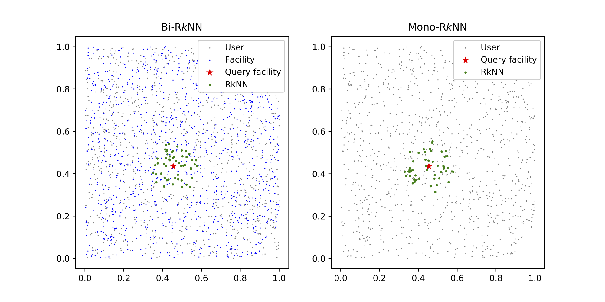

# CSD-R*k*NN: Conic Section Discriminances for Large Scale Reverse *k* Nearest Neighbors Queries
## Project structure
```
CSD-RkNN/:
├── data/: [data set]
│    ├── North America-1.txt
│    ├── North America-2.txt
│    ├── restaurant.csv
│    ├── mall.csv
│    ├── hospital.csv
│    ├── school.csv
│    └── residence.csv
├── common/: [common data structures, ploting functions and persistent dictionary]
│    ├── data_structure.py
│    ├── fig.py
│    └── persistence.py
├── index/: [spatial indices (including R-tree and VoR-tree)]
│    ├── rtree.py
│    └── vortree.py
├── rknn/: [RkNN algorithms (including CSD-RkNN, SLICE and VR-RkNN)]
│    ├── csd.py
│    ├── slice.py
│    └── vr.py
├── experiments.py [experiments (including benchmark experiments and case study experiments)]
└── test.py
```
## Usage
Generate the facility set and user set:
```python
>>> import numpy as np
>>> from shapely.geometry import Point
>>> from uuid import uuid1 as generate_uuid
>>> users = [(str(generate_uuid()), Point(np.random.uniform(0, 1), np.random.uniform(0, 1)))
             for i in range(1000)]
>>> facilities = [(str(generate_uuid()), Point(np.random.uniform(0, 1), np.random.uniform(0, 1)))
                  for i in range(1000)]
```
Index the facilities and users:
```python
>>> from index.vortree import VoRtreeIndex
>>> user_index = VoRtreeIndex(data=users)
>>> facility_index = VoRtreeIndex(data=facilities)
```
Choose one of these facilities as the query facility:
```python
>>> from random import choice
>>> q = facility_index.nodes[choice(facilities)[0]]
```
Retrieve the Bi-R*k*NNs of the query facility from the user set (*k*=50):
```python
>>> from rknn import csd
>>> bi_rknn = [(node.uuid,node.geom) for node in csd.BiRkNN(q, 50, facility_index, user_index)]
>>> print(bi_rknn)
[('454cfe0a-527f-11ec-87c0-80e650182120', <shapely.geometry.point.Point object at 0x7ff5f106a8b0>), 
 ('454cff04-527f-11ec-87c0-80e650182120', <shapely.geometry.point.Point object at 0x7ff5f361ee80>), 
 ...,
 ('454d02b0-527f-11ec-87c0-80e650182120', <shapely.geometry.point.Point object at 0x7ff5f361efd0>)]
```
Retrieve the Mono-R*k*NNs of the query facility from the facility set(*k*=50):
```python
>>> mono_rknn=list(csd.MonoRkNN(q,50,facility_index))
>>> print(mono_rknn)
[('454d0e40-527f-11ec-87c0-80e650182120', <shapely.geometry.point.Point object at 0x7ff5f3621460>), 
 ('454d158e-527f-11ec-87c0-80e650182120', <shapely.geometry.point.Point object at 0x7ff5f36215e0>), 
 ...,
 ('454d77b8-527f-11ec-87c0-80e650182120', <shapely.geometry.point.Point object at 0x7ff5f3629a60>)]
```
Plot the result:
```python
>>> import matplotlib.pyplot as plt
>>> fig = plt.figure(figsize=(10, 5))bi_rknn_ax = fig.add_subplot(121)
>>> bi_rknn_ax.scatter([u[1].x for u in users], [u[1].y for u in users], marker='.', c='gray', s=8,
                       linewidths=0,label='User')
>>> bi_rknn_ax.scatter([f[1].x for f in users], [f[1].y for f in facilities], marker='.', c='blue',
                       s=8, linewidths=0, label='Facility')
>>> bi_rknn_ax.scatter(q.geom.x, q.geom.y, marker='*', c='red', s=80, linewidths=0, label='Query facility')
>>> bi_rknn_ax.scatter([b[1].x for b in bi_rknn], [b[1].y for b in bi_rknn], marker='.', c='green',
                       s=30, linewidths=0, label='RkNN')
>>> bi_rknn_ax.legend(framealpha=1,loc=1)
>>> bi_rknn_ax.set_title('Bi-R$k$NN')
>>> mono_rknn_ax = fig.add_subplot(122)
>>> mono_rknn_ax.scatter([f[1].x for f in users], [f[1].y for f in facilities], marker='.', c='gray',
                         s=8, linewidths=0,label='User')
>>> mono_rknn_ax.scatter(q.geom.x, q.geom.y, marker='*', c='red', s=80, linewidths=0, label='Query facility')
>>> mono_rknn_ax.scatter([m[1].x for m in mono_rknn], [m[1].y for m in mono_rknn], marker='.', c='green',
                         s=30, linewidths=0, label='RkNN')
>>> mono_rknn_ax.legend(framealpha=1, loc=1)
>>> mono_rknn_ax.set_title('Mono-R$k$NN')
>>> plt.show()
```

## Evaluation
If you want to evaluate the performance of CSD-R*k*NN against other algorithms (e.g., SLICE and VR-R*k*NN), you can run the following codes.
```python
>>> # effect of data size on Mono-RkNN
>>> time_cost, io_cost = experiments.BenchmarkExperiments.evaluate_effect_of_data_size_on_MonoRkNN(10)
>>> plot_dual_distribution(time_cost)
>>> plot_dual_distribution(io_cost)
>>> time_cost, io_cost = experiments.BenchmarkExperiments.evaluate_effect_of_data_size_on_MonoRkNN(1000)
>>> plot_dual_distribution(time_cost)
>>> plot_dual_distribution(io_cost)
```
<table>
  <tr>
    <td align="center"><br>Time cost (k=10)</td>
    <td align="center"><br>Number of I/Os (k=10)</td>
  </tr>
  <tr>
    <td align="center"><br>Time cost (k=1000)</td>
    <td align="center"><br>Number of I/Os (k=1000)</td>
  </tr>
</table>

```python
>>> # effect of data size on Bi-RkNN
>>> time_cost, io_cost = experiments.BenchmarkExperiments.evaluate_effect_of_data_size_on_BiRkNN(10)
>>> plot_dual_distribution(time_cost)
>>> plot_dual_distribution(io_cost)
>>> time_cost, io_cost = experiments.BenchmarkExperiments.evaluate_effect_of_data_size_on_BiRkNN(1000)
>>> plot_dual_distribution(time_cost)
>>> plot_dual_distribution(io_cost)
```
<table>
  <tr>
    <td align="center"><br>Time cost (k=10)</td>
    <td align="center"><br>Number of I/Os (k=10)</td>
  </tr>
  <tr>
    <td align="center"><br>Time cost (k=1000)</td>
    <td align="center"><br>Number of I/Os (k=1000)</td>
  </tr>
</table>

```python
>>> # effect of k on Mono-RkNN
>>> time_cost, io_cost = experiments.BenchmarkExperiments.evaluate_effect_of_k_on_MonoRkNN('Synthetic')
>>> plot_dual_distribution(time_cost)
>>> plot_dual_distribution(io_cost)
>>> time_cost, io_cost = experiments.BenchmarkExperiments.evaluate_effect_of_k_on_MonoRkNN('Real')
>>> plot_single_distribution(time_cost)
>>> plot_single_distribution(io_cost)
```
<table>
  <tr>
    <td align="center"><br>Time cost (Synthetic)</td>
    <td align="center"><br>Number of I/Os (Synthetic)</td>
  </tr>
  <tr>
<td align="center"><br>Time cost (Real)</td>
    <td align="center"><br>Number of I/Os (Real)</td>
  </tr>
</table>

```python
>>> # effect of k on Bi-RkNN
>>> time_cost, io_cost = experiments.BenchmarkExperiments.evaluate_effect_of_k_on_BiRkNN('Synthetic')
>>> plot_dual_distribution(time_cost)
>>> plot_dual_distribution(io_cost)
>>> time_cost, io_cost = experiments.BenchmarkExperiments.evaluate_effect_of_k_on_BiRkNN('Real')
>>> plot_single_distribution(time_cost)
>>> plot_single_distribution(io_cost)
```
<table>
  <tr>
    <td align="center"><br>Time cost (Synthetic)</td>
    <td align="center"><br>Number of I/Os (Synthetic)</td>
  </tr>
  <tr>
    <td align="center"><br>Time cost (Real)</td>
    <td align="center"><br>Number of I/Os (Real)</td>
  </tr>
</table>

```python
>>> # effect of number of users relative to number of facilities
>>> time_cost, io_cost = experiments.BenchmarkExperiments.evaluate_effect_of_user_num_relative_to_facility_num(10)
>>> plot_dual_distribution(time_cost)
>>> plot_dual_distribution(io_cost)
>>> time_cost, io_cost = experiments.BenchmarkExperiments.evaluate_effect_of_user_num_relative_to_facility_num(1000)
>>> plot_dual_distribution(time_cost)
>>> plot_dual_distribution(io_cost)
```
<table>
  <tr>
    <td align="center"><br>Time cost (k=10)</td>
    <td align="center"><br>Number of I/Os (k=10)</td>
  </tr>
  <tr>
    <td align="center"><br>Time cost (k=1000)</td>
    <td align="center"><br>Number of I/Os (k=1000)</td>
  </tr>
</table>

```python
>>> # effect of data distribution
>>> time_cost, io_cost = experiments.BenchmarkExperiments.evaluate_effect_of_data_distribution(10)
>>> plot_single_distribution(time_cost)
>>> plot_single_distribution(io_cost)
>>> time_cost, io_cost = experiments.BenchmarkExperiments.evaluate_effect_of_data_distribution(1000)
>>> plot_single_distribution(time_cost)
>>> plot_single_distribution(io_cost)
```
<table>
  <tr>
    <td align="center"><br>Time cost (k=10)</td>
  </tr>
  <tr>
    <td align="center"><br>Number of I/Os (k=10)</td>
  </tr>
  <tr>
    <td align="center"><br>Time cost (k=1000)</td>
  </tr>
  <tr>
    <td align="center"><br>Number of I/Os (k=1000)</td>
  </tr>
</table>

```python
>>> # effect RkNN queries for restaurant
>>> time_cost, io_cost = experiments.CaseStudyExperiments.evaluate_RkNN_for_restaurant()
>>> plot_single_distribution(time_cost)
>>> plot_single_distribution(io_cost)
```
<table>
  <tr>
    <td align="center"><br>Time cost (Restaurant)</td>
    <td align="center"><br>Number of I/Os (Restaurant)</td>
  </tr>
</table>

```python
>>> # effect RkNN queries for mall
>>> time_cost, io_cost = experiments.CaseStudyExperiments.evaluate_RkNN_for_mall()
>>> plot_single_distribution(time_cost)
>>> plot_single_distribution(io_cost)
```
<table>
  <tr>
    <td align="center"><br>Time cost (Mall)</td>
    <td align="center"><br>Number of I/Os (Mall)</td>
  </tr>
</table>

```python
>>> # effect RkNN queries for hospital
>>> time_cost, io_cost = experiments.CaseStudyExperiments.evaluate_RkNN_for_hospital()
>>> plot_single_distribution(time_cost)
>>> plot_single_distribution(io_cost)
```
<table>
  <tr>
    <td align="center"><br>Time cost (Hospital)</td>
    <td align="center"><br>Number of I/Os (Hospital)</td>
  </tr>
</table>

```python
>>> # effect RkNN queries for school
>>> time_cost, io_cost = experiments.CaseStudyExperiments.evaluate_RkNN_for_school()
>>> plot_single_distribution(time_cost)
>>> plot_single_distribution(io_cost)
```
<table>
  <tr>
    <td align="center"><br>Time cost (School)</td>
    <td align="center"><br>Number of I/Os (School)</td>
  </tr>
</table>

Alternatively, you can run test.py on the terminal directly:
```
 python3 test.py
```
